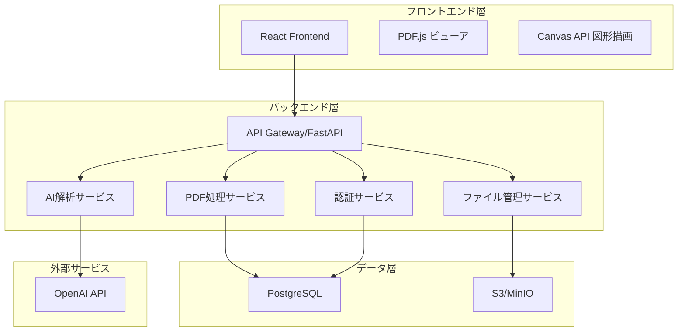
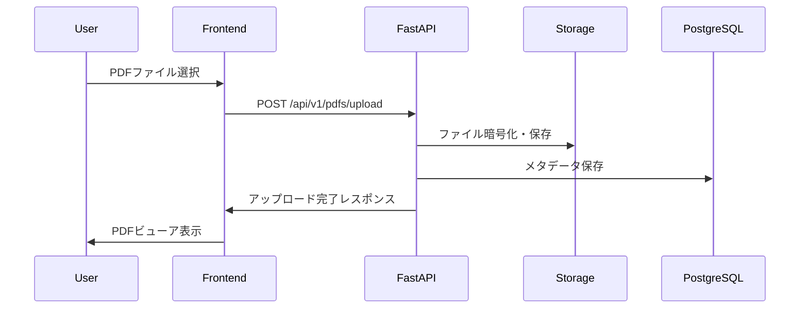
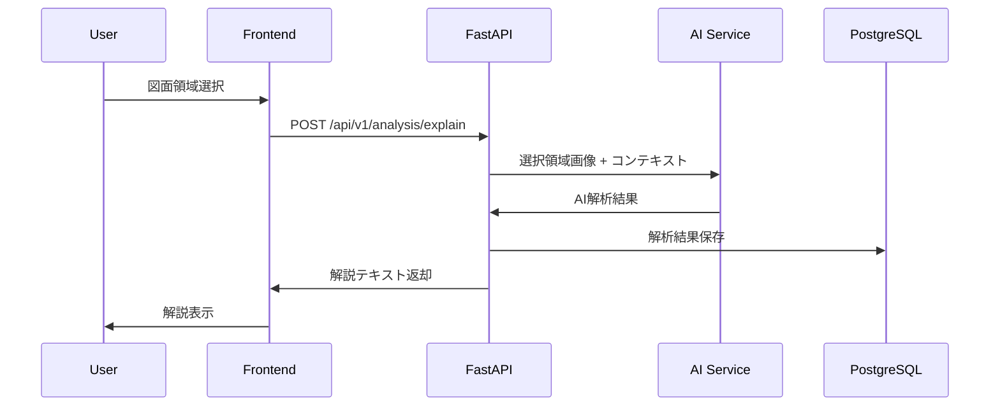

# 技術設計書

## 概要
PDF図面解説アプリケーションは、モダンなウェブアプリケーションとして構築されます。フロントエンドはReact + TypeScript、バックエンドはFastAPI + Python、AI解析にはOpenAI APIを活用したマイクロサービス型アーキテクチャを採用します。

## システムアーキテクチャ



## 技術スタック

### フロントエンド
- **フレームワーク**: React 18 + TypeScript
- **状態管理**: Zustand
- **UI コンポーネント**: Material-UI (MUI)
- **PDF表示**: PDF.js
- **図形描画**: Canvas API + Fabric.js
- **HTTP クライアント**: Axios
- **テスト**: Jest + React Testing Library

### バックエンド
- **フレームワーク**: FastAPI + Python 3.11
- **非同期処理**: Celery + Redis
- **認証**: JWT + OAuth2
- **データベース**: PostgreSQL 15
- **ORM**: SQLAlchemy + Alembic
- **ファイルストレージ**: MinIO (S3互換)
- **テスト**: pytest + httpx

### AI・機械学習
- **AI API**: OpenAI GPT-4 Vision
- **画像処理**: Pillow + OpenCV
- **PDF処理**: PyMuPDF (fitz)

### インフラ・運用
- **コンテナ**: Docker + Docker Compose
- **API ドキュメント**: OpenAPI/Swagger
- **監視**: Prometheus + Grafana
- **ログ**: structured logging (JSON)

## コンポーネント設計

### フロントエンドコンポーネント

#### 1. PDFビューアコンポーネント
```typescript
interface PDFViewerProps {
  pdfUrl: string;
  selections: Selection[];
  onAreaSelect: (area: Area) => void;
  onSelectionClear: () => void;
}

interface Selection {
  id: string;
  area: Area;
  color: string;
  explanation?: string;
}

interface Area {
  x: number;
  y: number;
  width: number;
  height: number;
  pageNumber: number;
}
```

#### 2. 選択領域管理コンポーネント
```typescript
interface SelectionManagerProps {
  selections: Selection[];
  onRequestExplanation: (selectionId: string) => void;
  onDeleteSelection: (selectionId: string) => void;
}
```

#### 3. AI解説表示コンポーネント
```typescript
interface ExplanationPanelProps {
  explanation: AIExplanation | null;
  isLoading: boolean;
  onSave: (explanation: AIExplanation) => void;
}

interface AIExplanation {
  id: string;
  selectionId: string;
  content: string;
  confidence: number;
  timestamp: Date;
  metadata: {
    modelVersion: string;
    processingTime: number;
  };
}
```

### バックエンドAPI エンドポイント

#### PDF管理API
```
POST /api/v1/pdfs/upload
GET /api/v1/pdfs/{pdf_id}
DELETE /api/v1/pdfs/{pdf_id}
GET /api/v1/pdfs/{pdf_id}/pages/{page_number}
```

#### 図面解析API
```
POST /api/v1/analysis/explain
GET /api/v1/analysis/{analysis_id}
POST /api/v1/analysis/{analysis_id}/feedback
```

#### 履歴管理API
```
GET /api/v1/history
GET /api/v1/history/{analysis_id}
DELETE /api/v1/history/{analysis_id}
POST /api/v1/history/export
```

#### 注釈管理API
```
POST /api/v1/annotations
PUT /api/v1/annotations/{annotation_id}
DELETE /api/v1/annotations/{annotation_id}
GET /api/v1/pdfs/{pdf_id}/annotations
```

## データモデル

### PDFファイル管理
```python
class PDFDocument(Base):
    __tablename__ = "pdf_documents"
    
    id: str = Column(String, primary_key=True)
    filename: str = Column(String, nullable=False)
    file_size: int = Column(Integer, nullable=False)
    file_path: str = Column(String, nullable=False)
    page_count: int = Column(Integer, nullable=False)
    upload_date: datetime = Column(DateTime, default=datetime.utcnow)
    user_id: str = Column(String, ForeignKey("users.id"))
    is_encrypted: bool = Column(Boolean, default=True)
    
    # リレーション
    analyses: List["Analysis"] = relationship("Analysis", back_populates="document")
    annotations: List["Annotation"] = relationship("Annotation", back_populates="document")
```

### 解析結果
```python
class Analysis(Base):
    __tablename__ = "analyses"
    
    id: str = Column(String, primary_key=True)
    document_id: str = Column(String, ForeignKey("pdf_documents.id"))
    selection_area: dict = Column(JSON, nullable=False)  # {x, y, width, height, page}
    explanation: str = Column(Text, nullable=False)
    confidence_score: float = Column(Float)
    model_version: str = Column(String)
    processing_time: float = Column(Float)
    created_at: datetime = Column(DateTime, default=datetime.utcnow)
    user_id: str = Column(String, ForeignKey("users.id"))
    
    # リレーション
    document: "PDFDocument" = relationship("PDFDocument", back_populates="analyses")
```

### 注釈データ
```python
class Annotation(Base):
    __tablename__ = "annotations"
    
    id: str = Column(String, primary_key=True)
    document_id: str = Column(String, ForeignKey("pdf_documents.id"))
    position: dict = Column(JSON, nullable=False)  # {x, y, page}
    content: str = Column(Text, nullable=False)
    style: dict = Column(JSON)  # {color, fontSize, fontFamily}
    created_at: datetime = Column(DateTime, default=datetime.utcnow)
    user_id: str = Column(String, ForeignKey("users.id"))
    
    # リレーション
    document: "PDFDocument" = relationship("PDFDocument", back_populates="annotations")
```

## データフロー

### 1. PDFアップロードフロー


### 2. AI解析フロー


## エラーハンドリング

### 1. フロントエンドエラー処理
```typescript
class ErrorBoundary extends React.Component {
  // PDFファイル処理エラー
  // ネットワークエラー
  // AI解析エラー
  // 認証エラー
}

const errorMessages = {
  PDF_UPLOAD_FAILED: 'PDFファイルのアップロードに失敗しました',
  UNSUPPORTED_FILE_TYPE: 'サポートされていないファイル形式です',
  FILE_SIZE_EXCEEDED: 'ファイルサイズが制限を超えています（最大: 50MB）',
  AI_ANALYSIS_FAILED: 'AI解析に失敗しました。しばらく待ってから再試行してください',
  NETWORK_ERROR: 'ネットワークエラーが発生しました'
};
```

### 2. バックエンドエラー処理
```python
class AppException(Exception):
    def __init__(self, message: str, error_code: str, status_code: int = 400):
        self.message = message
        self.error_code = error_code
        self.status_code = status_code

class PDFProcessingError(AppException):
    pass

class AIAnalysisError(AppException):
    pass

# カスタム例外ハンドラー
@app.exception_handler(AppException)
async def app_exception_handler(request: Request, exc: AppException):
    return JSONResponse(
        status_code=exc.status_code,
        content={
            "error": exc.error_code,
            "message": exc.message,
            "timestamp": datetime.utcnow().isoformat()
        }
    )
```

## セキュリティ設計

### 1. 認証・認可
- **JWT トークンベース認証**
- **OAuth2 プロバイダー統合** (Google, Microsoft)
- **ロールベースアクセス制御** (RBAC)

### 2. データ保護
```python
# ファイル暗号化
from cryptography.fernet import Fernet

class FileEncryption:
    def __init__(self, key: bytes):
        self.cipher = Fernet(key)
    
    def encrypt_file(self, file_data: bytes) -> bytes:
        return self.cipher.encrypt(file_data)
    
    def decrypt_file(self, encrypted_data: bytes) -> bytes:
        return self.cipher.decrypt(encrypted_data)
```

### 3. API セキュリティ
- **Rate Limiting**: 1分間に30リクエスト
- **CORS 設定**: 許可されたオリジンのみ
- **Input Validation**: Pydantic モデル
- **SQL Injection 防止**: SQLAlchemy ORM

## パフォーマンス・スケーラビリティ

### 1. フロントエンド最適化
- **PDF.js ワーカー**: PDFレンダリングの非同期処理
- **Canvas 仮想化**: 大きなPDFページの効率的レンダリング
- **画像遅延読み込み**: ページ単位での読み込み

### 2. バックエンド最適化
```python
# データベース接続プール
DATABASE_POOL_SIZE = 20
DATABASE_MAX_OVERFLOW = 30

# Redis キャッシュ
@lru_cache(maxsize=100)
async def get_pdf_metadata(pdf_id: str):
    # PDFメタデータキャッシュ
    pass

# 非同期ファイル処理
@celery.task
def process_pdf_async(pdf_id: str):
    # バックグラウンドでPDF処理
    pass
```

### 3. スケーリング戦略
- **水平スケーリング**: Kubernetes クラスター
- **CDN**: 静的ファイル配信最適化
- **データベース読み書き分離**: マスター・スレーブ構成

## テスト戦略

### 1. フロントエンドテスト
```typescript
// ユニットテスト
describe('PDFViewer Component', () => {
  test('should render PDF pages correctly', () => {
    // PDF表示テスト
  });
  
  test('should handle area selection', () => {
    // 領域選択テスト
  });
});

// インテグレーションテスト
describe('PDF Analysis Flow', () => {
  test('should complete end-to-end analysis', async () => {
    // E2E解析フローテスト
  });
});
```

### 2. バックエンドテスト
```python
# ユニットテスト
class TestPDFService:
    async def test_upload_pdf(self):
        # PDFアップロードテスト
        pass
    
    async def test_ai_analysis(self):
        # AI解析テスト
        pass

# インテグレーションテスト
class TestAPIEndpoints:
    async def test_pdf_upload_endpoint(self):
        # APIエンドポイントテスト
        pass
```

### 3. E2Eテスト
```typescript
// Playwright E2Eテスト
test('Complete PDF analysis workflow', async ({ page }) => {
  await page.goto('/');
  await page.setInputFiles('input[type="file"]', 'sample.pdf');
  await page.click('[data-testid="upload-button"]');
  await expect(page.locator('[data-testid="pdf-viewer"]')).toBeVisible();
  
  // 領域選択とAI解析のテスト
  await page.locator('[data-testid="pdf-canvas"]').click();
  await page.click('[data-testid="analyze-button"]');
  await expect(page.locator('[data-testid="explanation-panel"]')).toBeVisible();
});
```