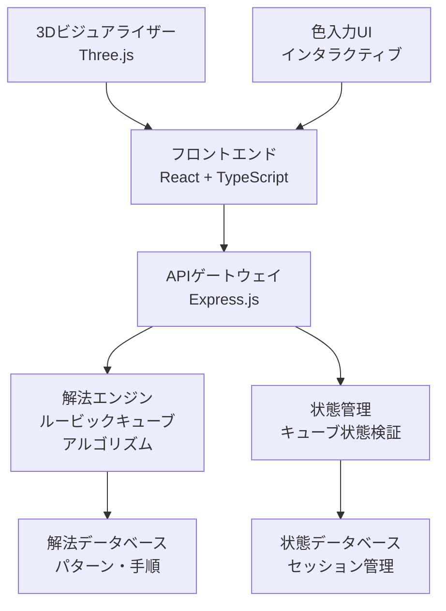

# 技術設計書

## 概要
ルービックキューブの状態認識と解法提案を行うWebアプリケーション。フロントエンドでキューブの状態入力と視覚的指示を提供し、バックエンドで解法アルゴリズムを実行する。リアルタイムでの状態更新と段階的な解法ガイダンスを実現する。

## アーキテクチャ



## 技術スタック

### フロントエンド
- **フレームワーク**: React 18 + TypeScript
- **3D描画**: Three.js（キューブ可視化）
- **UIライブラリ**: Material-UI（一貫性のあるUI）
- **状態管理**: React Context + useReducer
- **スタイリング**: CSS Modules + Emotion

### バックエンド
- **API**: Express.js + TypeScript
- **解法エンジン**: 
  - Kociemba Algorithm（最適解法）
  - Layer-by-Layer Method（初心者向け）
- **状態検証**: カスタムキューブバリデーター
- **データベース**: SQLite（軽量、設定不要）

### 開発・デプロイ
- **パッケージ管理**: npm
- **ビルドツール**: Vite
- **テスト**: Jest + React Testing Library + Playwright
- **デプロイ**: Vercel（フロントエンド）+ Railway（バックエンド）

## コンポーネント設計

### フロントエンドコンポーネント

#### CubeInputComponent
```typescript
interface CubeInputProps {
  onStateChange: (state: CubeState) => void;
  currentState: CubeState;
  validationErrors: ValidationError[];
}

// 6面のキューブ状態を視覚的に入力
// 色選択パレットとクリックベースの入力
// リアルタイム検証とエラー表示
```

#### CubeVisualizerComponent
```typescript
interface CubeVisualizerProps {
  cubeState: CubeState;
  highlightMove?: Move;
  animationSpeed: number;
}

// Three.jsを使用した3Dキューブ表示
// 推奨される次の手の視覚的ハイライト
// 回転アニメーション
```

#### SolutionStepComponent
```typescript
interface SolutionStepProps {
  currentMove: Move;
  totalSteps: number;
  currentStep: number;
  onExecuteMove: () => void;
  onSkipMove: () => void;
}

// 現在の手順の表示
// 記号説明と視覚的ガイド
// 進捗表示
```

### バックエンドAPI

#### キューブ状態API
```typescript
POST /api/cube/validate
// キューブ状態の物理的可能性を検証
{
  "state": CubeState,
  "response": {
    "valid": boolean,
    "errors": ValidationError[]
  }
}

GET /api/cube/solve
// 解法手順の計算
{
  "state": CubeState,
  "algorithm": "kociemba" | "layer-by-layer",
  "response": {
    "moves": Move[],
    "totalSteps": number,
    "estimatedTime": number
  }
}

POST /api/cube/next-move
// 次の推奨手の取得
{
  "currentState": CubeState,
  "targetState": CubeState,
  "response": {
    "move": Move,
    "explanation": string,
    "remainingSteps": number
  }
}
```

## データモデル

### CubeState
```typescript
interface CubeState {
  faces: {
    front: Color[][];   // 3x3の色配列
    right: Color[][];
    back: Color[][];
    left: Color[][];
    up: Color[][];
    down: Color[][];
  };
  isValid: boolean;
  isSolved: boolean;
}

type Color = 'white' | 'yellow' | 'red' | 'orange' | 'blue' | 'green';
```

### Move
```typescript
interface Move {
  notation: string;        // "R", "U'", "F2" など
  face: 'F' | 'R' | 'U' | 'L' | 'B' | 'D';
  direction: 'clockwise' | 'counterclockwise';
  angle: 90 | 180;
  description: string;     // 日本語での説明
}
```

### SolutionPath
```typescript
interface SolutionPath {
  id: string;
  initialState: CubeState;
  moves: Move[];
  algorithm: string;
  difficulty: 'beginner' | 'intermediate' | 'advanced';
  estimatedTime: number;
  createdAt: Date;
}
```

## データフロー

### 状態入力フロー
1. ユーザーがCubeInputComponentで色を設定
2. リアルタイムでフロントエンド検証
3. 完了時にバックエンドで物理的検証
4. 有効な場合、解法計算を開始

### 解法実行フロー
1. バックエンドで解法アルゴリズム実行
2. 手順リストをフロントエンドに返送
3. SolutionStepComponentで一手ずつ表示
4. ユーザー実行後、状態更新と次手計算

## エラーハンドリング

### フロントエンド
```typescript
interface ErrorBoundary {
  // React Error Boundaryで予期しないエラーをキャッチ
  // ユーザーフレンドリーなエラー画面を表示
  // エラー情報をローカルストレージに保存
}

interface ValidationErrorHandler {
  // 入力検証エラーの即座な表示
  // 具体的な修正方法の提案
  // 部分的な状態での継続可能性
}
```

### バックエンド
```typescript
interface APIErrorHandler {
  // 統一されたエラーレスポンス形式
  // 日本語でのエラーメッセージ
  // ログ記録と監視
}

class CubeValidationError extends Error {
  constructor(
    public code: string,
    public userMessage: string,
    public suggestedFix: string
  ) {}
}
```

## セキュリティ考慮事項

### データ検証
- 入力データのサニタイゼーション
- SQLインジェクション対策
- XSS攻撃の防止

### アクセス制御
- レート制限（API呼び出し）
- セッション管理
- CORS設定

### プライバシー
- ユーザーデータの最小限収集
- セッションデータの自動削除
- 分析データの匿名化

## パフォーマンス最適化

### フロントエンド
- React.memoを使用したコンポーネント最適化
- Three.jsの描画パフォーマンス調整
- 画像・3Dモデルの遅延読み込み
- Web Workersでの重い計算処理

### バックエンド
- 解法結果のメモリキャッシュ
- データベース最適化
- アルゴリズム選択の動的調整
- 並列処理での解法計算

## テスト戦略

### 単体テスト
```typescript
// フロントエンド: Jest + React Testing Library
describe('CubeInputComponent', () => {
  test('色入力による状態更新', () => {});
  test('無効状態でのエラー表示', () => {});
});

// バックエンド: Jest
describe('CubeSolver', () => {
  test('既知パターンの解法', () => {});
  test('無効状態の拒否', () => {});
});
```

### 統合テスト
```typescript
// API全体のフロー
describe('Cube Solving Flow', () => {
  test('状態入力から解法完了まで', () => {});
  test('エラー状態からの復旧', () => {});
});
```

### E2Eテスト
```typescript
// Playwright
test('完全な解法プロセス', async ({ page }) => {
  // ユーザーの完全なジャーニー
  // 状態入力 → 解法実行 → 完成確認
});
```