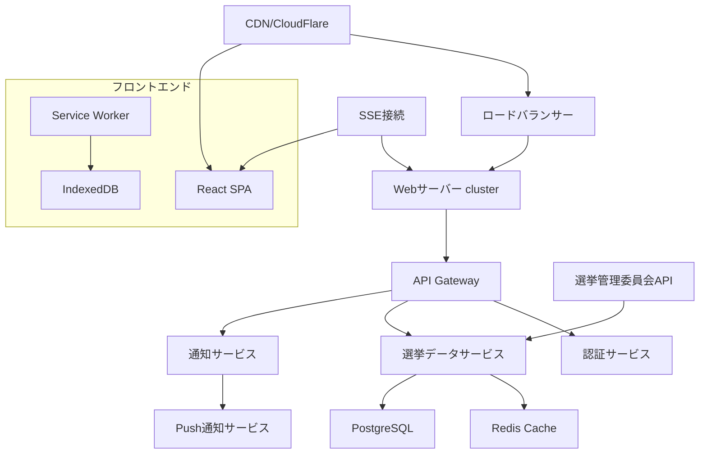

# 技術設計書

## 概要
参議院選挙の当選結果をリアルタイムで表示するWebアプリケーションの技術設計。高負荷時も安定稼働し、10万人以上の同時接続に対応可能なスケーラブルアーキテクチャを採用。Server-Sent Events（SSE）によるリアルタイム通信と、マイクロサービス・CDN・キャッシュ戦略を組み合わせて高性能を実現する。

## アーキテクチャ



## 技術スタック

### フロントエンド
- **フレームワーク**: React 18 + TypeScript
- **状態管理**: Zustand（軽量で高性能）
- **スタイリング**: Tailwind CSS + CSS Modules
- **ビルドツール**: Vite（高速ビルド）
- **PWA**: Service Worker + IndexedDB
- **リアルタイム通信**: EventSource API（SSE）
- **チャート**: D3.js + React-vis

### バックエンド
- **API**: FastAPI + Python 3.12
- **非同期処理**: asyncio + uvloop
- **WebServer**: Gunicorn + Uvicorn workers
- **API Gateway**: Kong または AWS API Gateway
- **認証**: JWT + OAuth 2.0

### データベース・キャッシュ
- **メインDB**: PostgreSQL 15
- **キャッシュ**: Redis 7.x（クラスター構成）
- **全文検索**: Elasticsearch

### インフラストラクチャ
- **コンテナ**: Docker + Kubernetes
- **CDN**: CloudFlare
- **ロードバランサー**: NGINX + HAProxy
- **モニタリング**: Prometheus + Grafana
- **ログ**: ELK Stack

## コンポーネント設計

### フロントエンドコンポーネント

```typescript
// 主要コンポーネント構成
interface ElectionDashboard {
  components: {
    Header: NavigationComponent;
    RealTimeCounter: LiveVoteCounter;
    DistrictMap: InteractiveMap;
    PartySeats: SeatDistribution;
    CandidateList: CandidateResultList;
    NotificationPanel: AlertSystem;
  };
}

// リアルタイムデータ管理
interface ElectionStore {
  districts: District[];
  candidates: Candidate[];
  partySeats: PartyResult[];
  lastUpdated: Date;
  connectionStatus: 'connected' | 'disconnected' | 'error';
}
```

### APIエンドポイント

```python
# 主要APIエンドポイント
GET /api/v1/election/results          # 全体結果概要
GET /api/v1/districts/{id}/results    # 選挙区別結果
GET /api/v1/parties/seats             # 政党別議席数
GET /api/v1/candidates/{id}           # 候補者詳細
POST /api/v1/notifications/subscribe  # 通知購読
GET /api/v1/sse/election-updates      # SSEストリーム

# リアルタイム更新エンドポイント
GET /api/v1/sse/live-results         # Server-Sent Events
```

## データフロー

### リアルタイム更新フロー
1. **データ取得**: 選挙管理委員会APIから30秒間隔でポーリング
2. **データ処理**: 差分検出・集計・キャッシュ更新
3. **配信準備**: Redis Pubsubで更新イベント発行
4. **クライアント配信**: SSEで接続中の全クライアントに即座配信
5. **UI更新**: フロントエンドで自動的にUI更新

### キャッシュ戦略
```python
# 多層キャッシュ戦略
CACHE_LAYERS = {
    'CDN': '5分（静的アセット）',
    'API Gateway': '30秒（API レスポンス）',
    'Redis': '10秒（データベースクエリ）',
    'Browser': '1分（クライアントサイド）'
}
```

## データモデル

### 選挙結果データ構造

```typescript
interface District {
  id: string;
  name: string;
  prefecture: string;
  totalVotes: number;
  validVotes: number;
  invalidVotes: number;
  turnoutRate: number;
  candidates: Candidate[];
  lastUpdated: Date;
}

interface Candidate {
  id: string;
  name: string;
  party: string;
  votes: number;
  voteRate: number;
  status: 'elected' | 'leading' | 'defeated' | 'pending';
  isIncumbent: boolean;
}

interface PartyResult {
  partyName: string;
  totalSeats: number;
  districtSeats: number;
  proportionalSeats: number;
  seatChange: number;
}

interface ElectionUpdate {
  type: 'district_update' | 'candidate_status' | 'party_seats';
  districtId?: string;
  candidateId?: string;
  data: any;
  timestamp: Date;
}
```

## エラーハンドリング

### フロントエンド
```typescript
// SSE接続エラーハンドリング
class ElectionSSEManager {
  private reconnectAttempts = 0;
  private maxReconnects = 5;
  
  handleConnectionError() {
    if (this.reconnectAttempts < this.maxReconnects) {
      setTimeout(() => this.reconnect(), 1000 * (this.reconnectAttempts + 1));
      this.reconnectAttempts++;
    } else {
      this.fallbackToPolling();
    }
  }
  
  fallbackToPolling() {
    // SSE接続失敗時は30秒間隔のポーリングに切り替え
    setInterval(() => this.fetchLatestData(), 30000);
  }
}
```

### バックエンド
```python
# API レート制限・エラーハンドリング
@app.middleware("http")
async def error_handling_middleware(request, call_next):
    try:
        response = await call_next(request)
        return response
    except ExternalAPIError:
        return JSONResponse(
            status_code=503,
            content={"error": "選挙データの取得に失敗しました"}
        )
    except DatabaseError:
        return JSONResponse(
            status_code=500,
            content={"error": "データベース接続エラー"}
        )
```

## セキュリティ対策

### 認証・認可
- JWT トークンベース認証
- API キーによるレート制限
- CORS設定による不正アクセス防止

### データ保護
```python
# セキュリティヘッダー設定
SECURITY_HEADERS = {
    'X-Content-Type-Options': 'nosniff',
    'X-Frame-Options': 'DENY',
    'X-XSS-Protection': '1; mode=block',
    'Strict-Transport-Security': 'max-age=31536000',
    'Content-Security-Policy': "default-src 'self'; script-src 'self' 'unsafe-inline'"
}
```

## パフォーマンス・スケーラビリティ

### 高負荷対応戦略
1. **水平スケーリング**: Kubernetes Auto Scaling
2. **データベース最適化**: 読み取り専用レプリカ・インデックス最適化
3. **CDN配信**: 静的コンテンツの高速配信
4. **接続プール**: データベース接続の効率化

### SSE接続管理
```python
# SSE接続プール管理
class SSEConnectionManager:
    def __init__(self):
        self.connections: Dict[str, Set[SSEConnection]] = {}
        self.max_connections_per_server = 10000
    
    async def broadcast_to_district(self, district_id: str, data: dict):
        if district_id in self.connections:
            await asyncio.gather(*[
                conn.send(data) for conn in self.connections[district_id]
            ])
```

### キャッシュ最適化
- **Redis クラスター**: 高可用性とデータ分散
- **マテリアライズドビュー**: 事前集計済みデータの活用
- **クエリ最適化**: インデックス設計とクエリパフォーマンス向上

## テスト戦略

### フロントエンド
- **単体テスト**: Jest + React Testing Library
- **統合テスト**: Cypress
- **パフォーマンステスト**: Lighthouse CI

### バックエンド
- **単体テスト**: pytest + pytest-asyncio
- **API テスト**: FastAPI TestClient
- **負荷テスト**: Locust（10万同時接続）

### システムテスト
```python
# 負荷テストシナリオ
class ElectionLoadTest(HttpUser):
    wait_time = between(1, 3)
    
    @task
    def view_results(self):
        self.client.get("/api/v1/election/results")
    
    @task
    def subscribe_to_updates(self):
        # SSE接続の負荷テスト
        with self.client.get("/api/v1/sse/live-results", stream=True) as response:
            for line in response.iter_lines():
                if line:
                    data = json.loads(line.decode('utf-8'))
                    # データ処理をシミュレート
```

## デプロイメント・運用

### CI/CD パイプライン
```yaml
# GitHub Actions ワークフロー
name: Deploy Election App
on:
  push:
    branches: [main]
    
jobs:
  deploy:
    runs-on: ubuntu-latest
    steps:
      - name: Run Tests
        run: npm test && pytest
      - name: Build Docker Images
        run: docker build -t election-app .
      - name: Deploy to Kubernetes
        run: kubectl apply -f k8s/
```

### モニタリング・アラート
- **レスポンス時間**: 3秒以下維持
- **SSE接続数**: リアルタイム監視
- **エラー率**: 1%以下維持
- **CPU/メモリ使用率**: 80%以下維持

## 災害復旧・事業継続

### 高可用性設計
- **Multi-AZ構成**: データベース・アプリケーションの冗長化
- **自動フェイルオーバー**: 障害時の自動切り替え
- **バックアップ戦略**: 15分間隔の差分バックアップ

### 緊急時対応
```python
# 緊急時の静的ページ表示
@app.exception_handler(DatabaseUnavailable)
async def database_unavailable_handler(request, exc):
    return HTMLResponse(
        content=open('emergency_page.html').read(),
        status_code=503
    )
```