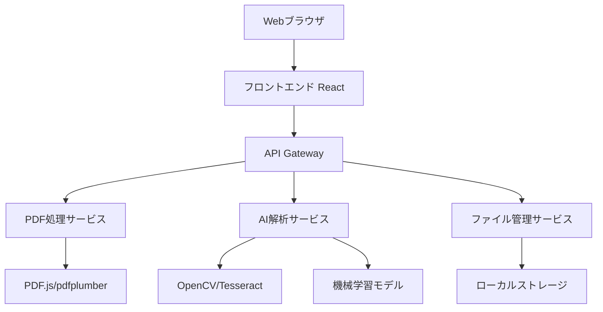

# 設計文書

## 概要

PDF図面解説アプリケーションは、Webベースのアプリケーションとして設計し、フロントエンドでPDFビューアとインタラクティブUI、バックエンドでPDF解析とAI処理を行う。マイクロサービス的なアーキテクチャを採用し、スケーラビリティと保守性を確保する。

## アーキテクチャ



### 技術スタック

- **フロントエンド**: React + TypeScript + PDF.js
- **バックエンド**: Python FastAPI
- **PDF処理**: pdfplumber + PyMuPDF
- **画像処理**: OpenCV + Pillow
- **OCR**: Tesseract OCR
- **AI/ML**: scikit-learn + OpenAI API（図面解釈）
- **データベース**: SQLite（開発）/ PostgreSQL（本番）
- **ファイルストレージ**: ローカルファイルシステム

## コンポーネントと インターフェース

### フロントエンドコンポーネント

1. **FileUploadComponent**
   - PDF ファイルのドラッグ&ドロップ
   - 複数ファイル選択対応
   - ファイル検証（PDF形式、サイズ制限）

2. **PDFViewerComponent**
   - PDF.js を使用したPDF表示
   - ズーム、パン機能
   - クリック可能な要素のハイライト

3. **AnalysisResultComponent**
   - 解析結果の表示
   - 基本情報（タイトル、縮尺、寸法）
   - 構成要素の解説リスト

4. **InteractiveOverlayComponent**
   - PDF上のクリック可能領域
   - ツールチップでの詳細表示
   - 要素のハイライト機能

5. **ExportComponent**
   - 結果のテキスト/PDF出力
   - 一括処理結果のダウンロード

### バックエンドサービス

1. **PDFProcessingService**
   ```python
   class PDFProcessor:
       def extract_text(self, pdf_path: str) -> Dict
       def extract_images(self, pdf_path: str) -> List[Image]
       def get_metadata(self, pdf_path: str) -> Dict
       def extract_coordinates(self, pdf_path: str) -> List[Element]
   ```

2. **ImageAnalysisService**
   ```python
   class ImageAnalyzer:
       def detect_shapes(self, image: Image) -> List[Shape]
       def extract_dimensions(self, image: Image) -> List[Dimension]
       def recognize_symbols(self, image: Image) -> List[Symbol]
       def perform_ocr(self, image: Image) -> List[TextElement]
   ```

3. **AIExplanationService**
   ```python
   class ExplanationGenerator:
       def generate_overview(self, elements: List[Element]) -> str
       def explain_element(self, element: Element) -> str
       def create_detailed_analysis(self, drawing_data: Dict) -> str
   ```

4. **FileManagementService**
   ```python
   class FileManager:
       def save_upload(self, file: UploadFile) -> str
       def save_result(self, result: Dict, format: str) -> str
       def cleanup_temp_files(self) -> None
   ```

## データモデル

### DrawingElement
```python
@dataclass
class DrawingElement:
    id: str
    type: ElementType  # LINE, CIRCLE, RECTANGLE, TEXT, DIMENSION, SYMBOL
    coordinates: List[Point]
    properties: Dict[str, Any]
    confidence: float
    explanation: Optional[str]
```

### AnalysisResult
```python
@dataclass
class AnalysisResult:
    drawing_id: str
    title: Optional[str]
    scale: Optional[str]
    dimensions: List[str]
    elements: List[DrawingElement]
    overall_explanation: str
    processing_time: float
    created_at: datetime
```

### ProcessingJob
```python
@dataclass
class ProcessingJob:
    job_id: str
    files: List[str]
    status: JobStatus  # PENDING, PROCESSING, COMPLETED, FAILED
    results: List[AnalysisResult]
    error_messages: List[str]
    created_at: datetime
    completed_at: Optional[datetime]
```

## エラーハンドリング

### エラータイプ

1. **FileValidationError**: 無効なPDFファイル
2. **ProcessingError**: PDF解析エラー
3. **AIServiceError**: AI解析サービスエラー
4. **StorageError**: ファイル保存エラー

### エラー処理戦略

- フロントエンド: ユーザーフレンドリーなエラーメッセージ表示
- バックエンド: 構造化ログ出力、エラー詳細のトラッキング
- 部分的失敗: 処理可能な部分は継続、エラー部分はスキップ
- リトライ機構: 一時的なエラーに対する自動再試行

## テスト戦略

### 単体テスト
- 各サービスクラスのメソッド単位でのテスト
- モックを使用した外部依存関係の分離
- エッジケースとエラーケースのカバレッジ

### 統合テスト
- API エンドポイントのテスト
- ファイルアップロードから結果出力までのフロー
- 複数ファイル処理のテスト

### E2Eテスト
- ブラウザ自動化によるユーザーシナリオテスト
- 実際のPDF図面を使用した動作確認
- パフォーマンステスト（大きなファイル、複数ファイル）

### テストデータ
- 様々な種類の図面サンプル（機械図面、建築図面、電気図面）
- 異なる品質・解像度のPDFファイル
- エラーケース用の破損ファイル