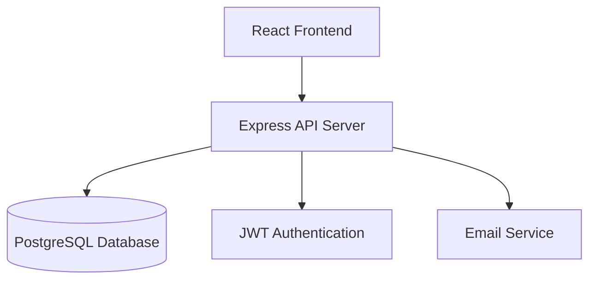

# Design Document

## Overview

Todoistライクなタスク管理サービスを、モダンなWebアプリケーションとして設計します。フロントエンドはReact + TypeScript、バックエンドはNode.js + Express + TypeScript、データベースはPostgreSQLを使用し、RESTful APIアーキテクチャを採用します。

## Architecture

### System Architecture



### Technology Stack

**Frontend:**
- React 18 with TypeScript
- React Router for routing
- Axios for API communication
- Material-UI or Tailwind CSS for styling
- React Hook Form for form management

**Backend:**
- Node.js with Express.js
- TypeScript for type safety
- JWT for authentication
- bcrypt for password hashing
- nodemailer for email functionality

**Database:**
- PostgreSQL for data persistence
- Prisma ORM for database operations

**Development Tools:**
- Vite for frontend build tool
- ESLint + Prettier for code quality
- Jest for testing

## Components and Interfaces

### Frontend Components

#### Core Components
- `App`: メインアプリケーションコンポーネント
- `TaskList`: タスク一覧表示コンポーネント
- `TaskItem`: 個別タスク表示コンポーネント
- `TaskForm`: タスク作成・編集フォーム
- `ProjectSidebar`: プロジェクト一覧サイドバー
- `SearchBar`: 検索・フィルタリングコンポーネント

#### Authentication Components
- `LoginForm`: ログインフォーム
- `RegisterForm`: アカウント作成フォーム
- `ProtectedRoute`: 認証が必要なルートの保護

### Backend API Endpoints

#### Authentication
- `POST /api/auth/register` - アカウント作成
- `POST /api/auth/login` - ログイン
- `POST /api/auth/logout` - ログアウト
- `GET /api/auth/me` - 現在のユーザー情報取得

#### Tasks
- `GET /api/tasks` - タスク一覧取得（フィルタリング対応）
- `POST /api/tasks` - タスク作成
- `GET /api/tasks/:id` - 特定タスク取得
- `PUT /api/tasks/:id` - タスク更新
- `DELETE /api/tasks/:id` - タスク削除
- `PATCH /api/tasks/:id/complete` - タスク完了状態切り替え

#### Projects
- `GET /api/projects` - プロジェクト一覧取得
- `POST /api/projects` - プロジェクト作成
- `PUT /api/projects/:id` - プロジェクト更新
- `DELETE /api/projects/:id` - プロジェクト削除

## Data Models

### User Model
```typescript
interface User {
  id: string;
  email: string;
  password: string; // hashed
  name: string;
  createdAt: Date;
  updatedAt: Date;
}
```

### Project Model
```typescript
interface Project {
  id: string;
  name: string;
  color: string;
  userId: string;
  createdAt: Date;
  updatedAt: Date;
}
```

### Task Model
```typescript
interface Task {
  id: string;
  title: string;
  description?: string;
  completed: boolean;
  priority: 'low' | 'medium' | 'high';
  dueDate?: Date;
  completedAt?: Date;
  projectId?: string;
  userId: string;
  createdAt: Date;
  updatedAt: Date;
}
```

### Database Schema

```sql
-- Users table
CREATE TABLE users (
  id UUID PRIMARY KEY DEFAULT gen_random_uuid(),
  email VARCHAR(255) UNIQUE NOT NULL,
  password VARCHAR(255) NOT NULL,
  name VARCHAR(255) NOT NULL,
  created_at TIMESTAMP DEFAULT CURRENT_TIMESTAMP,
  updated_at TIMESTAMP DEFAULT CURRENT_TIMESTAMP
);

-- Projects table
CREATE TABLE projects (
  id UUID PRIMARY KEY DEFAULT gen_random_uuid(),
  name VARCHAR(255) NOT NULL,
  color VARCHAR(7) DEFAULT '#3498db',
  user_id UUID REFERENCES users(id) ON DELETE CASCADE,
  created_at TIMESTAMP DEFAULT CURRENT_TIMESTAMP,
  updated_at TIMESTAMP DEFAULT CURRENT_TIMESTAMP
);

-- Tasks table
CREATE TABLE tasks (
  id UUID PRIMARY KEY DEFAULT gen_random_uuid(),
  title VARCHAR(500) NOT NULL,
  description TEXT,
  completed BOOLEAN DEFAULT FALSE,
  priority VARCHAR(10) DEFAULT 'medium',
  due_date TIMESTAMP,
  completed_at TIMESTAMP,
  project_id UUID REFERENCES projects(id) ON DELETE SET NULL,
  user_id UUID REFERENCES users(id) ON DELETE CASCADE,
  created_at TIMESTAMP DEFAULT CURRENT_TIMESTAMP,
  updated_at TIMESTAMP DEFAULT CURRENT_TIMESTAMP
);
```

## Error Handling

### Frontend Error Handling
- APIエラーレスポンスの統一的な処理
- ユーザーフレンドリーなエラーメッセージ表示
- ネットワークエラー時の再試行機能
- フォームバリデーションエラーの表示

### Backend Error Handling
- 統一されたエラーレスポンス形式
- HTTPステータスコードの適切な使用
- バリデーションエラーの詳細な情報提供
- ログ記録とエラー監視

```typescript
interface ErrorResponse {
  error: {
    message: string;
    code: string;
    details?: any;
  };
}
```

### Error Types
- `VALIDATION_ERROR` - 入力データの検証エラー
- `AUTHENTICATION_ERROR` - 認証エラー
- `AUTHORIZATION_ERROR` - 認可エラー
- `NOT_FOUND_ERROR` - リソースが見つからない
- `INTERNAL_SERVER_ERROR` - サーバー内部エラー

## Testing Strategy

### Frontend Testing
- **Unit Tests**: 個別コンポーネントのロジックテスト（Jest + React Testing Library）
- **Integration Tests**: コンポーネント間の連携テスト
- **E2E Tests**: ユーザーフローの完全なテスト（Cypress）

### Backend Testing
- **Unit Tests**: 個別関数・メソッドのテスト（Jest）
- **Integration Tests**: API エンドポイントのテスト（Supertest）
- **Database Tests**: データベース操作のテスト

### Test Coverage Goals
- Unit Tests: 80%以上のコードカバレッジ
- Integration Tests: 主要なAPIエンドポイントの完全カバー
- E2E Tests: 重要なユーザーフローの完全カバー

### Testing Environment
- テスト用データベースの分離
- モックデータの活用
- CI/CDパイプラインでの自動テスト実行